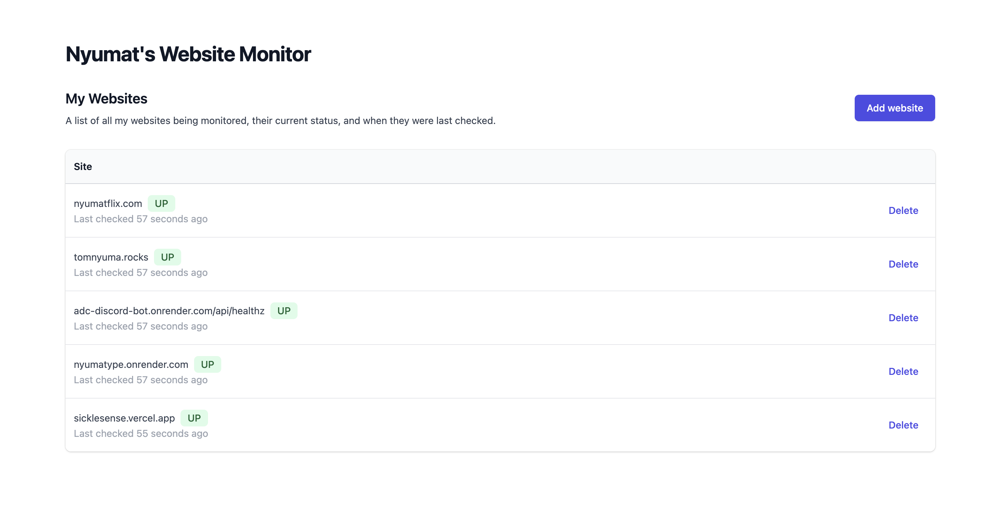

# nyuptime - an uptime monitoring service for my websites

I got tired of managing 100s of random web apps that I've built and the status of them. UptimeRobot is nice, but also paid, too feature-rich, and requires me to give my information to _yet_ another company.

So, I built this application & its services to be a thing that continuously monitors the uptime of a list websites.

## How it works

There's an endpoint & UI to add websites.

When it detects (through another API, `GET /ping/:websiteURL`) one of my listed websites going down, it sends a Discord message to my private guild notifying me that the website is down, and another message when the website is back up again.

There's also a [frontend](https://prod-uptime-d4i2.encr.app/frontend) that shows the status of all the websites I'm monitoring.

## Features

- **Ping a website**: Check if a website is up or down
- **Track a website**: Add a website to be checked every 5 minutes
- **Check all websites**: Check all tracked websites immediately
- **List all websites**: Get the current status of all tracked websites
- **Notify on Discord**: Send a message to a Discord channel when a website goes down or comes back up
- **Frontend**: Show the status of all websites, and allow adding new websites

## Architecture

The application is built using [Encore](https://encore.dev), a platform for building and deploying cloud applications. It uses the following services:

- **API**: A Go API that tracks websites and checks their status
- **Frontend**: A React frontend that shows the status of all websites
- **Database**: Two PostgreSQL databases to store the list of websites and list of checks (how we determine if a website's last state)
- **Pub/Sub**: A Pub/Sub topic to broadcast messages when a website goes down or comes back up
- **Cron Jobs**: A cron job that checks all websites every 1 hour
- **Secrets**: A secret to store the Discord webhook URL
- **Auth**: An auth provider to authenticate users to add/remove websites

## Getting Started

You will need the [Encore CLI](https://encore.dev/docs/install) to run and deploy this application.

To install Encore, run:

```bash
# macOS
brew install encoredev/tap/encore

# Windows
iwr https://encore.dev/install.ps1 | iex

# Linux
curl -L https://encore.dev/install.sh | bash
```

Clone and run the app locally:

```bash
git clone https://github.com/Nyumat/nyuptime.git
cd nyuptime

# Log in to Encore
encore auth login

# Set the Slack webhook secret (see tutorial above)
encore secret set DiscordWebhookURL

# Run the app
encore run
```

## Using the API

```bash
# Check if a given site is up (defaults to 'https://' if left out)
$ curl 'http://localhost:4000/ping/google.com'

# Add a site to be automatically pinged every 5 minutes
curl 'http://localhost:4000/site' -d '{"url":"google.com"}'

# Check all tracked sites immediately
curl -X POST 'http://localhost:4000/checkall'

# Get the current status of all tracked sites
curl 'http://localhost:4000/sites'
```

## Deployment

```bash
encore app create nyuptime-but-ur-own-name
git push origin main
```

Then head over to <https://app.encore.dev> to find out your production URL, and off you go into the clouds!

## Testing

```bash
encore test ./...
```
